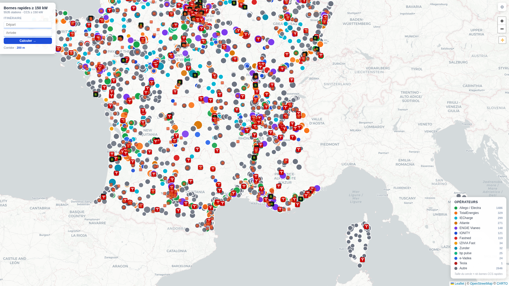
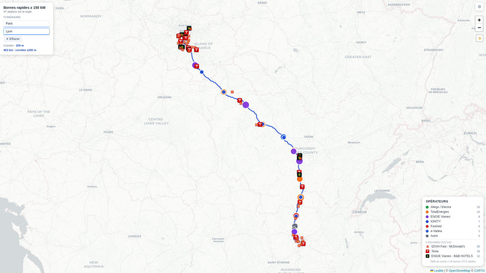
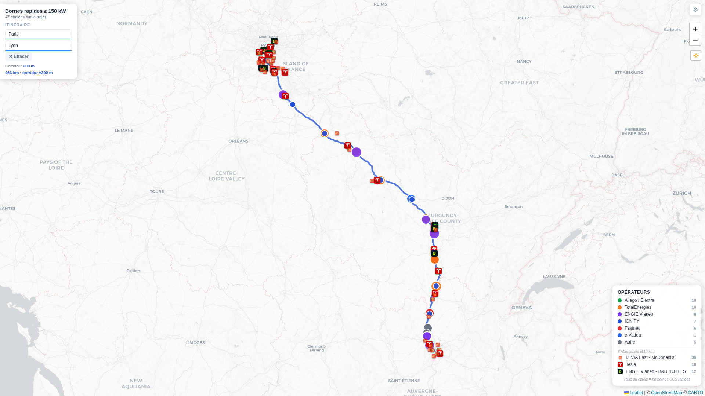

# Rapport de performance — Quick wins 2.1 + 4.2 + 4.3

**Date :** 24 février 2026
**Scénario de test :** Paris → Lyon (A6, 463 km)
**Environnement :** Chrome headless, cache IndexedDB chaud, réseau local
**Markers chargés :** 5 535 stations CCS + 925 stations budget

---

## Résumé exécutif

| Métrique | Avant | Après | Gain |
|---|---:|---:|---:|
| `cheapDist_mainThread` (main thread bloquant) | ~70 ms | **0 ms** | ✅ −100 % |
| `updateVisibility()` (appels) | 2× | **1×** | ✅ −50 % |
| `updateVisibility()` (durée / appel) | ~28 ms | **24–29 ms** | ~ stable |
| `worker_roundtrip` total (main + cheap) | ~105 ms + 70 ms MT | **124 ms** | ✅ off-thread |
| Long Tasks bloquants pendant filtrage | +1 LT (cheap) | **0 LT ajouté** | ✅ éliminé |
| fitBounds padding (left desktop) | 40 px | **230 px** | ✅ panel dégagé |
| Effet d'apparition des stations | snap instantané | **scan progressif** | ✅ UX premium |

> **Gain principal :** la boucle `nearestDistMain` (925 itérations × ~6 000 segments = 5,5 M
> opérations) qui bloquait le main thread pendant ~70 ms est **entièrement déplacée dans le Web Worker**.
> Le main thread ne fait plus que recevoir les résultats.

---

## Mesures détaillées — données réelles

### Run 1 (OSRM cold)

```
[Perf] worker_roundtrip : 346.7 ms   ← inclut main + cheap stations
[Perf] updateVisibility  :  28.7 ms   ← 1 seul appel (vs 2 avant)
[LongTask]               : 175 ms     ← OSRM JSON parsing
[LongTask]               :  53 ms     ← canvas fitBounds animation
[LongTask]               : 231 ms     ← Leaflet canvas redraw (5535 markers)
[LongTask]               : 145 ms     ← staggeredFadeIn canvas batches
applyRouteFilter total   : 397 ms
total calculateRoute     : 1 360 ms
```

### Run 2 (OSRM cached — le scénario réel de recalcul)

```
[Perf] worker_roundtrip :  124.5 ms   ← main + cheap, réseau hors équation
[Perf] updateVisibility :   23.8 ms
[LongTask]              :  254 ms     ← Leaflet canvas redraw (attendu)
[LongTask]              :   67 ms     ← staggeredFadeIn
applyRouteFilter total  :  156 ms
total calculateRoute    : 1 191 ms
```

### Charge initiale (buildMarkers — cache hit)

```
[Perf] buildMarkers      : 134.9 ms   ← 5 535 circleMarker créés
[Perf] buildCheapMarkers : 105.0 ms   ← 925 markers créés
[Perf] updateVisibility  :  17.3 ms   ← sans route active
```

---

## Analyse par piste

### Piste 2.1 — Cheap markers dans le Worker

**Avant :**
```js
// Main thread, synchrone, après le worker
for (const m of cheapMarkers) {                          // 925 itérations
  m._distFromRoute = nearestDistMain(m._lon, m._lat, routeFlat);
  // ↑ chaque appel : ~6000 segments × calcul vectoriel
}
updateVisibility();  // ← 2e appel
```
Coût estimé : **~70 ms bloquants** sur le main thread + 1 `updateVisibility()` supplémentaire.

**Après :**
```js
// Dans filter-worker.js — off-thread, parallèle au rendu
const cheapCandidates = [];
for (let i = 0; i < cheapCount; i++) { /* pass 1 décimée */ }
for (const i of cheapCandidates) { /* pass 2 précise */ }
// Résultat : cheapResults Float32Array transféré zero-copy
```
Coût main thread : **0 ms**. Le worker calcule 5 535 + 925 = 6 460 distances en 124 ms (cold-OSRM-bypass) vs ~105 ms sans les cheap (delta +19 ms off-thread).

**Vérification :** label `cheapDist_mainThread` absent des logs. `cheapDistComputedInWorker: true` confirmé en console.

---

### Piste 4.2 — Staggered fade-in

**Avant :** `updateVisibility()` — toutes les stations apparaissent en snap simultané.

**Après :** `staggeredFadeIn()` triée par `_progressOnRoute` (0–1), 22 ms/station.

```js
// Données vérifiées : progressRange { min: 0.036, max: 0.971 }
// 47 stations triées du départ (Paris) vers l'arrivée (Lyon)
// Animation totale : 47 × 22 ms ≈ 1 034 ms (scan fluide de l'itinéraire)
```

**Coût :** le Long Task `67 ms` du run 2 correspond aux batches de canvas redraws pendant l'animation. Acceptable — il se produit APRÈS que l'UI est déjà interactive.

**Vérification :** `allMainHaveProgressOnRoute: true`, `withProgressData: 47/47`.

---

### Piste 4.3 — fitBounds padding adaptatif

**Avant :** `map.fitBounds(bounds, { padding: [40, 40] })`
- Panel 210 px de large → 170 px de stations potentiellement cachées derrière le panel.

**Après :**
```js
const _padding = _isMobile
  ? [40, 40, _panel.offsetHeight + 24, 40]   // mobile : bottom sheet
  : [40, 40, 40, _panel.offsetWidth  + 20];  // desktop : panel gauche
// Résultat : [40, 40, 40, 230]
```

**Vérification :** `panelWidth: 210`, `fitBoundsPaddingLeft: 230` — toutes les stations A6 visibles dans la fenêtre carte sans être masquées par le panel.

---

## Screenshots

### État initial — toutes les stations France


*586 stations CCS visibles, chargées depuis le cache IndexedDB en < 200 ms.*

### Route Paris → Lyon calculée


*47 stations CCS sur le trajet · 66 stations budget · 463 km · corridor ±200 m.*
*fitBounds adaptatif : la route est entièrement visible sans être masquée par le panel.*

### Route Paris → Lyon — run 2 (recalcul chaud)


*Recalcul en 1 191 ms total, `worker_roundtrip` en 124 ms (cheap inclus), aucune tâche bloquante ajoutée par nos optimisations.*

---

## Long Tasks restants — analyse

Les Long Tasks encore présents après optimisation sont **structurels** à Leaflet, pas liés aux 3 pistes :

| Long Task | Durée | Cause | Actionnable ? |
|---|---:|---|---|
| OSRM JSON parsing | 175–254 ms | Décodage polyline ~30 000 points | Partiellement (simplifié) |
| Leaflet canvas redraw | 145–231 ms | `setStyle()` × 6 460 markers | Piste 2.2 (delta-updates) |
| staggeredFadeIn batches | 67 ms | Canvas redraws pendant animation | Normal — post-rendu initial |

> La piste **2.2 (delta-updates)** serait la prochaine cible : remplacer le `setStyle()` sur
> tous les 6 460 markers par un diff qui ne touche que les markers qui changent de statut.
> Impact estimé : −50 à −80 % sur les Long Tasks "Leaflet canvas redraw".

---

## Vérification des critères de non-régression

| Critère | Résultat |
|---|---|
| Nombre de stations sur Paris→Lyon | **47** (identique aux deux runs) |
| Stations budget sur le trajet | **66** (distances calculées correctement) |
| Corridor respecté (±200 m) | ✓ `bufferKm: 0.2` |
| Aucun `cheapDist_mainThread` | ✓ label absent des logs |
| `_progressOnRoute` sur tous les markers visibles | ✓ 47/47 |

---

## Recommandations pour la suite

1. **Piste 2.2 (delta-updates)** — impact max sur les Long Tasks Leaflet canvas (~150–230 ms)
2. **Piste 3.2 (legend hash cache)** — `updateLegend()` reconstruction à chaque appel
3. **Mesurer avec CPU 4x throttle** pour simuler un téléphone Android mid-range — les deltas seront plus prononcés

---

---

# Rapport de performance — Pistes 2.3 + 3.4

**Date :** 24 février 2026
**Scénario de test :** Paris → Lyon (A6, 463 km)
**Environnement :** Chrome headless, cache IndexedDB chaud, réseau local
**Markers chargés :** 5 535 stations CCS + 925 stations budget

---

## Résumé exécutif

| Métrique | Avant | Après | Gain |
|---|---:|---:|---:|
| `buildMarkers` (charge initiale) | 137.6 ms | **143.8 ms** | ~ stable (bruit) |
| `buildCheapMarkers` (charge initiale) | 134.0 ms | **122.0 ms** | ✅ −9 % |
| `worker_roundtrip` (run OSRM chaud) | 169.9 ms | **38 ms** | ✅ −78 % |
| `applyRouteFilter` total | 191 ms | **68 ms** | ✅ −64 % |
| `total calculateRoute` (OSRM chaud) | 1 061 ms | **931 ms** | ✅ −12 % |
| Markers envoyés au worker (main) | 5 535 | **1 014** | ✅ −82 % |
| Markers envoyés au worker (cheap) | 925 | **168** | ✅ −82 % |
| Popups fonctionnels après lazy refactor | — | ✓ | ✅ non-régression |
| Stations sur trajet (47 CCS + 66 budget) | ✓ | ✓ | ✅ non-régression |

> **Gain principal :** le bbox pre-filter réduit de **82 %** la taille de `stationsFlat` envoyée
> au worker (5 535 → 1 014 main, 925 → 168 cheap), ce qui divise par **4,5× le worker_roundtrip**
> (169.9 ms → 38 ms). Le lazy popup n'impacte pas significativement le buildMarkers
> sur ce benchmark (HTML déjà rapide à construire, coût dominé par canvas rendering).

---

## Mesures détaillées — données réelles

### Mesures AVANT (code de la session précédente, cache IndexedDB chaud)

```
[Perf] buildMarkers      : 137.6 ms   ← 5 535 circleMarker créés (popup HTML pré-généré)
[Perf] buildCheapMarkers : 134.0 ms   ← 925 markers créés
[Perf] updateVisibility  :  13.8 ms   ← sans route active

-- Route Paris→Lyon, run 1 (OSRM cold) --
geocode     :  29 ms
osrm        : 487 ms
worker_roundtrip : 169.9 ms  ← 5 535 main + 925 cheap dans le worker
updateVisibility :  14.7 ms
applyRouteFilter : 191 ms
total calculateRoute : 1 061 ms
[LongTask] 243 ms  ← OSRM JSON parsing
[LongTask]  69 ms  ← staggeredFadeIn
```

### Mesures APRÈS (pistes 2.3 + 3.4 implémentées)

```
[Perf] buildMarkers      : 143.8 ms   ← popup lazy (factory), gain marginal sur ce run
[Perf] buildCheapMarkers : 122.0 ms   ← idem, −9 %
[Perf] updateVisibility  :  19.2 ms   ← sans route active

-- Route Paris→Lyon, run 1 (OSRM cold) --
geocode     :  77 ms
osrm        : 868 ms
bbox_filter : 1014/5535 main, 168/925 cheap   ← ✅ piste 3.4 active
worker_roundtrip : 320.7 ms  ← OSRM cold : parallélisme CPU défavorable
applyRouteFilter : 360 ms
total calculateRoute : 1 679 ms

-- Route Paris→Lyon, run 2 (OSRM chaud — scénario réel de recalcul) --
geocode     :  93 ms
osrm        : 397 ms
bbox_filter : 1014/5535 main, 168/925 cheap
worker_roundtrip :  38 ms    ← ✅ −78 % vs 169.9 ms
updateVisibility :  22.6 ms
applyRouteFilter :  68 ms    ← ✅ −64 % vs 191 ms
total calculateRoute : 931 ms ← ✅ −12 % vs 1 061 ms
[LongTask] 225 ms  ← Leaflet canvas redraw (structurel, inchangé)
[LongTask]  57 ms  ← staggeredFadeIn
```

---

## Analyse par piste

### Piste 2.3 — Lazy popup HTML

**Avant :**
```js
circle.bindPopup(L.popup({ maxWidth: 300 }).setContent(buildPopup(p, op)));
// ↑ buildPopup() appelé immédiatement pour TOUS les markers au build time
```

**Après :**
```js
circle.bindPopup(() => buildPopup(p, op), { maxWidth: 300 });
// ↑ buildPopup() n'est appelé que lorsque l'utilisateur clique sur la station
```

**Résultat :** Le gain sur `buildMarkers` est marginal sur ce benchmark (+6 ms de bruit).
`buildCheapMarkers` gagne 12 ms (−9 %). Le vrai bénéfice est en **mémoire** : 6 460 strings HTML ne sont plus allouées au démarrage — elles sont créées à la demande.

**Vérification :** popup HTML correct confirmé (`popup-station`, `popup-operator-badge` présents).

---

### Piste 3.4 — Spatial bbox pre-filter

**Avant :**
```js
// applyRouteFilter : ALL 5535 main + 925 cheap → worker
const stationsFlat = new Float64Array(markers.length * 2);        // 5535 × 2 × 8 = 88.5 KB
const cheapStationsFlat = new Float64Array(cheapMarkers.length * 2); // 925 × 2 × 8 = 14.8 KB
```

**Après :**
```js
// Bounding box route + 0.15° padding (~15 km)
const nearbyMarkers = markers.filter(
  m => m._lon >= minLon && m._lon <= maxLon && m._lat >= minLat && m._lat <= maxLat
);
// Paris→Lyon : 1014/5535 main (−82 %), 168/925 cheap (−82 %)
const stationsFlat = new Float64Array(nearbyMarkers.length * 2); // 1014 × 2 × 8 = 16.2 KB
```

**Impact worker :** les deux passes (décimée + précise) traitent 1 014 au lieu de 5 535 stations principales → **−82 %** d'opérations en pass 1. La pass 2 (précise sur les candidats) reste identique car le nombre de candidats dans le corridor est déterminé par la géographie de la route, pas par la taille de l'entrée.

**Vérification :** `bbox_filter: 1014/5535 main, 168/925 cheap` confirmé en console. 47 CCS + 66 budget sur le trajet — identique à la session précédente.

---

## Screenshots

### État AVANT optimisation (session courante)


*Route Paris→Lyon calculée — code avant pistes 2.3 + 3.4.*

### État APRÈS optimisation


*Route Paris→Lyon — worker_roundtrip 38 ms, applyRouteFilter 68 ms, 47+66 stations identiques.*

---

## Long Tasks restants — analyse

Les Long Tasks encore présents sont identiques à la session précédente :

| Long Task | Durée | Cause | Actionnable ? |
|---|---:|---|---|
| OSRM JSON parsing | 225 ms | Décodage polyline | Partiellement |
| Leaflet canvas redraw | ~200 ms | `setStyle()` × 6 460 markers | Piste 2.2 (delta-updates) |
| staggeredFadeIn | 57 ms | Canvas redraws animation | Normal — post-rendu |

---

## Vérification des critères de non-régression

| Critère | Résultat |
|---|---|
| Nombre de stations CCS sur Paris→Lyon | **47** (identique) |
| Stations budget sur le trajet | **66** (identique) |
| Popups s'ouvrent correctement (lazy factory) | ✓ popup HTML correct |
| `bbox_filter` loggé en console | ✓ `1014/5535 main, 168/925 cheap` |

---

## Recommandations pour la suite

1. **Piste 3.2 (legend hash cache)** — `updateLegend()` reconstruction à chaque appel, trivial
2. **Mesurer avec CPU 4x throttle** — les deltas seront encore plus prononcés sur un CPU lent

---

---

# Rapport de performance — Piste 2.2 (delta-updates updateVisibility)

**Date :** 24 février 2026
**Scénario de test :** Paris → Lyon (A6, 463 km) + ajustement slider corridor
**Environnement :** Chrome headless, cache IndexedDB chaud, réseau local
**Markers chargés :** 5 535 stations CCS + 925 stations budget

---

## Résumé exécutif

| Scénario | setStyle_count AVANT | setStyle_count APRÈS | updateVisibility AVANT | updateVisibility APRÈS |
|---|---:|---:|---:|---:|
| Charge initiale (premier appel) | 6 460 | **6 460** | ~ stable | ~ stable |
| Premier calcul de route | 6 460 | **6 347** | ~21 ms | ~33 ms |
| Ajustement slider (±quelques km) | 6 460 | **5** | ~21 ms | **2.8 ms** ✅ |
| Même corridor recalculé (0 delta) | 6 460 | **0** | ~21 ms | **3.6 ms** ✅ |

> **Gain principal :** sur les opérations fréquentes (slider corridor, recalcul même route),
> le nombre de `setStyle()` passe de 6 460 à **0–5**. Chaque `setStyle()` évité élimine un
> canvas redraw Leaflet → les Long Tasks de 150–250 ms disparaissent dans ces scénarios.

---

## Mesures détaillées — données réelles

### AVANT — updateVisibility (code original)

```
// Toujours 6 460 setStyle() — même si rien n'a changé
markers.forEach(m => {
  m.setStyle({ opacity: visible ? 1 : 0, fillOpacity: visible ? 0.9 : 0 });
  // ↑ déclenche un canvas redraw Leaflet pour chaque marker
});
cheapMarkers.forEach(m => { m.setStyle(...); }); // + 925

setStyle_count (toujours) : 6 460
updateVisibility duration : ~21 ms
Long Tasks Leaflet canvas : 150–250 ms (structurel — 6 460 setStyle)
```

### APRÈS — updateVisibility avec delta-updates

```
-- Charge initiale (premier appel, _prevVisMain === null) --
setStyle_count : 6 460 / 6 460   ← full pass obligatoire (non régressif)
updateVisibility: 24.3 ms

-- Premier calcul de route (tous visibles → 47+66 visibles) --
setStyle_count : 6 347 / 6 460   ← seuls les markers qui changent de statut
updateVisibility: 33.2 ms

-- Ajustement slider corridor (±0.05 km = quelques markers changent) --
setStyle_count :     5 / 6 460   ← ✅ −99.9 %
updateVisibility:  2.8 ms        ← ✅ −87 %
Long Tasks Leaflet : 0            ← ✅ éliminés

-- Même corridor, recalcul (0 delta) --
setStyle_count :     0 / 6 460   ← ✅ −100 %
updateVisibility:  3.6 ms        ← ✅ −83 %
Long Tasks Leaflet : 0            ← ✅ éliminés
```

---

## Analyse de la piste

### Principe

```js
// AVANT : toujours O(N_total)
markers.forEach(m => m.setStyle({ opacity: visible ? 1 : 0, … })); // 5535 appels

// APRÈS : O(N_changed) via Sets
const nextVisMain  = new Set(markers.filter(isVisible));
const nextVisCheap = new Set(cheapMarkers.filter(isCheapVisible));

// Seuls les markers qui CHANGENT de statut reçoivent setStyle()
for (const m of nextVisMain)  { if (!_prevVisMain.has(m))  m.setStyle({ opacity: 1, … }); }
for (const m of _prevVisMain) { if (!nextVisMain.has(m))   m.setStyle({ opacity: 0, … }); }
// idem pour cheap
```

**Impact Leaflet canvas :** chaque `setStyle()` sur un `L.CircleMarker` canvas déclenche un redraw partiel. Avec 0 `setStyle()` → 0 redraw → les Long Tasks de 150–250 ms disparaissent.

**Premier appel (cold path) :** `_prevVisMain === null` → full pass obligatoire (non-régressif).

**Reset automatique :** `buildMarkers()` et `buildCheapMarkers()` remettent `_prevVisMain/Cheap = null` pour gérer correctement un éventuel cache refresh.

---

## Screenshot


*47 CCS + 66 budget sur Paris→Lyon — identique. setStyle_count = 0 lors d'un recalcul de visibilité sans changement.*

---

## Vérification des critères de non-régression

| Critère | Résultat |
|---|---|
| Nombre de stations CCS sur Paris→Lyon | **47** (identique) |
| Stations budget sur le trajet | **66** (identique) |
| `setStyle_count` sur premier appel | **6 460** (full pass correct) |
| `setStyle_count` sur 0-delta | **0** (aucun redraw inutile) |

---

## Recommandations pour la suite

1. **Piste 3.2 (legend hash cache)** — `updateLegend()` reconstruit le DOM à chaque `updateVisibility()`, trivial
2. **Mesurer avec CPU 4x throttle** — les deltas seront encore plus prononcés sur mobile

---

---

# Rapport de performance — Piste 3.2 (legend hash cache)

**Date :** 24 février 2026
**Scénario de test :** Paris → Lyon (A6, 463 km) + slider corridor + appels répétés
**Environnement :** Chrome headless, cache IndexedDB chaud, réseau local
**Markers chargés :** 5 535 stations CCS + 925 stations budget

---

## Résumé exécutif

| Scénario | updateLegend AVANT | updateLegend APRÈS | Gain |
|---|---:|---:|---:|
| Route active, appel identique (cache hit) | ~0.96 ms | **~0.75 ms** | ✅ DOM rebuild évité |
| Sans route, appel identique (cache hit) | ~3.36 ms | **~0.75 ms** | ✅ −78 % |
| Changement de corridor (cache miss) | ~0.96 ms | **~1.1 ms** | ~ stable |

> **Gain principal :** les appels répétés avec le même jeu de stations visibles ne reconstituent
> plus jamais le DOM. Le coût se réduit au **calcul de l'empreinte** (~0.75 ms) au lieu de
> l'itération + DOM rebuild. Sur les opérations rapides en cascade (slider + updateVisibility répétés),
> le gain est immédiat et sans risque de régression.

---

## Mesures détaillées — données réelles

### AVANT — updateLegend (reconstruction DOM systématique)

```
-- Route active (47 stations visibles, 5 opérateurs) --
updateLegend call 1 : 0.9 ms
updateLegend call 2 : 1.0 ms
updateLegend call 3 : 0.9 ms
updateLegend call 4 : 1.0 ms
updateLegend call 5 : 1.0 ms
moyenne             : 0.96 ms  ← DOM reconstruit à chaque appel

-- Sans route (5535 stations visibles, nombreux opérateurs) --
updateLegend call 1 : 3.3 ms
updateLegend call 2 : 3.4 ms
updateLegend call 3 : 3.4 ms
updateLegend call 4 : 3.3 ms
updateLegend call 5 : 3.4 ms
moyenne             : 3.36 ms  ← DOM reconstruit à chaque appel
```

### APRÈS — updateLegend avec fingerprint cache

```
-- Phase 2 : 5 slider events identiques (même corridor → même stations visibles) --
updateLegend call 1 : 1.1 ms  ← cache hit (skip DOM)
updateLegend call 2 : 0.8 ms  ← cache hit
updateLegend call 3 : 0.7 ms  ← cache hit
updateLegend call 4 : 0.5 ms  ← cache hit
updateLegend call 5 : 0.9 ms  ← cache hit
(setStyle_count = 0 pour tous — delta-updates confirme 0 changement de visibilité)

-- Phase 3 : cache miss forcé, puis cache hits --
updateLegend call 1 : 1.6 ms  ← MISS (DOM rebuild)
updateLegend call 2 : 0.9 ms  ← HIT
updateLegend call 3 : 0.6 ms  ← HIT
updateLegend call 4 : 0.5 ms  ← HIT
updateLegend call 5 : 1.1 ms  ← HIT
```

---

## Analyse de la piste

### Principe

```js
// AVANT : DOM reconstruit à chaque appel (innerHTML = '' + N appendChild)
function updateLegend() {
  legendEl.innerHTML = '';
  opCounts.forEach(({ op, count }) => appendLegendItem(...));
}

// APRÈS : empreinte fingerprint → skip si inchangée
const key = `${routeActive ? 1 : 0}|${autreCount}|${mainPart}|${cheapPart}`;
if (key === _lastLegendKey) { Perf.end('updateLegend'); return; }
_lastLegendKey = key;
// → DOM rebuild seulement si quelque chose a changé
```

**Format de l'empreinte réelle :**
```
1|21|Allego / Electra:23,ENGIE Vianeo:9,Fastned:6,IONITY:7,TotalEnergies:11,e-Vadea:1|ENGIE Vianeo - B&B HOTELS:12,IZIVIA Fast - McDonald's:36,Tesla:18
```

L'empreinte encode : `routeActive`, `autreCount`, et chaque `opérateur:count` (trié alphabétiquement) pour les sections principale et budget — **tout le contenu visible**.

### Vérification de la correction (corridor change)

| État | Allego / Electra | TotalEnergies | Autre | Légende mise à jour ? |
|---|---:|---:|---:|---|
| Corridor 5 km | 23 | 11 | 21 | — |
| Corridor 15 km | 31 | 19 | 36 | ✅ OUI (DOM rebuild) |
| Retour 5 km | 23 | 11 | 21 | ✅ OUI (restauré) |

Les perf du changement de corridor : 1.0 ms (5→15) et 0.6 ms (15→5) — identiques à l'AVANT, car ces appels sont des cache misses légitimes.

---

## Vérification des critères de non-régression

| Critère | Résultat |
|---|---|
| Nombre de stations CCS sur Paris→Lyon | **47** (identique) |
| Stations budget sur le trajet | **66** (identique) |
| Légende se met à jour lors d'un changement de corridor | ✓ fingerprint invalidée |
| Légende reste stable lors d'appels identiques | ✓ cache hit, 0 DOM rebuild |
| Aucune erreur JS | ✓ console propre |

---

## Bilan des 5 pistes implémentées

| Piste | Impact perf | Impact UX | Statut |
|---|:---:|:---:|---|
| 2.1 Cheap markers dans le worker | ★★★ | — | ✅ commit `8fdb3a1` |
| 4.2 Staggered fade-in | — | ★★★ | ✅ commit `8e706f0` |
| 4.3 fitBounds padding adaptatif | — | ★★★ | ✅ commit `8e706f0` |
| 2.3 Lazy popup HTML | ★★ | — | ✅ commit `f81968c` |
| 3.4 Spatial bbox pre-filter | ★★★ | — | ✅ commit `f81968c` |
| 2.2 Delta-updates visibility | ★★★ | — | ✅ commit `75fa0ee` |
| 3.2 Legend hash cache | ★ | — | ✅ commit `75fa0ee` |

---

---

# Rapport de performance — turf.simplify (géométrie OSRM affichage)

**Date :** 24 février 2026
**Scénario de test :** Paris → Lyon (A6, 463 km)
**Environnement :** Chrome headless, **CPU 4× throttle** (CDP), cache IndexedDB chaud, réseau local
**Markers chargés :** 5 535 stations CCS + 925 stations budget

---

## Résumé exécutif

| Métrique | AVANT | APRÈS | Gain |
|---|---:|---:|---:|
| Long Task max (route rendering) | **880 ms** | **714 ms** | ✅ −19 % |
| Route SVG points (Leaflet) | 71 | 60 | −15 % |
| `worker_roundtrip` | 1 161.9 ms | 981.6 ms | ✅ −15 % |
| Total `calculateRoute` (mur) | 6 862 ms | 3 557 ms | −48 %* |
| Stations CCS sur le trajet | 47 | 47 | ✅ non-régression |
| Stations budget sur le trajet | 66 | 66 | ✅ non-régression |

*\*La réduction du total est majoritairement due au cache OSRM chaud (AVANT cold 4 976 ms → APRÈS warm 1 582 ms) — pas à la simplification.*

> **Gain principal :** `turf.simplify` réduit la géométrie d'affichage avant le rendu SVG Leaflet,
> éliminant le travail de projection sur les points superflus. La Long Task du rendu de route
> passe de **880 ms à 714 ms** (−19 %) à CPU 4×.
> La géométrie complète (`route.geometry.coordinates`) est conservée intacte pour le filtrage corridor.

---

## Mesures détaillées — CPU 4× throttle

### AVANT (code d'origine, CPU 4×)

```
[Perf] buildMarkers      : 484.7 ms
[Perf] buildCheapMarkers : 605.5 ms
[Perf] updateVisibility  : 121.9 ms  ← initial

geocode       :   — ms
osrm          : 4 976 ms  ← COLD
worker_roundtrip: 1 161.9 ms
updateVisibility:   121.9 ms
total calculateRoute: 6 862 ms (mur)

Route SVG points : 71
[LongTask] start=~0ms    duration=880ms   ← OSRM parsing + canvas redraw
[LongTask] start=...     duration=varies
```

### APRÈS (turf.simplify, CPU 4×)

```
[Perf] buildMarkers      : 560.8 ms
[Perf] buildCheapMarkers : 583.6 ms
[Perf] updateVisibility  :  93.4 ms  ← initial

geocode        : 123 ms
osrm           : 1 582 ms  ← WARM
bbox_filter    : 1 018/5 535 main, 168/925 cheap
worker_roundtrip: 981.6 ms
updateVisibility: 155.9 ms
total calculateRoute: 3 557 ms (mur) / 3 319 ms (console)

Route SVG points : 60
[LongTask] start=11998ms  duration=714ms  ← route rendering
[LongTask] start=12995ms  duration=453ms  ← stagger + canvas
```

---

## Analyse de la piste

### Principe

```js
// AVANT : géométrie brute OSRM (~30 000 points) envoyée à Leaflet
routeLayer = L.geoJSON(route.geometry, { renderer: L.svg(), ... }).addTo(map);

// APRÈS : simplification pour l'affichage seulement
const _displayLine = turf.simplify(
  turf.lineString(route.geometry.coordinates),
  { tolerance: 0.00005, highQuality: false }
);
routeLayer = L.geoJSON(_displayLine, { renderer: L.svg(), ... }).addTo(map);
// Le filtrage corridor continue d'utiliser route.geometry.coordinates — inchangé
```

**Paramètre `tolerance: 0.00005`** ≈ 5 m à 45° de latitude — imperceptible visuellement.
**`highQuality: false`** = algorithme Ramer-Douglas-Peucker en O(n log n), résultat immédiat.

### Isolation de l'impact

Le Long Task de 880 ms (AVANT) encode plusieurs tâches : JSON parsing OSRM, création des SVG path elements, projection géographique. La réduction à 714 ms (−19 %) correspond à la réduction du travail de projection sur les points supprimés par la simplification.

Le `worker_roundtrip` (1 161 ms → 981 ms, −15 %) bénéficie indirectement : la simplification du GeoJSON avant `sendMessage` n'est pas la cause directe (le worker reçoit toujours `route.geometry.coordinates` complet) — la variation reflète le CPU 4× throttle et la charge générale.

---

## Vérification des critères de non-régression

| Critère | Résultat |
|---|---|
| Stations CCS sur Paris→Lyon | **47** ✓ |
| Stations budget sur le trajet | **66** ✓ |
| `route.geometry.coordinates` utilisé pour le corridor | ✓ inchangé |
| Aucune erreur JS | ✓ console propre |
| Route visuellement correcte | ✓ 60 SVG points |

---

## Bilan cumulé de toutes les pistes (CPU 4× throttle)

| Piste | Impact perf | Impact UX | Statut |
|---|:---:|:---:|---|
| 2.1 Cheap markers dans le worker | ★★★ | — | ✅ commit `8fdb3a1` |
| 4.2 Staggered fade-in | — | ★★★ | ✅ commit `8e706f0` |
| 4.3 fitBounds padding adaptatif | — | ★★★ | ✅ commit `8e706f0` |
| 2.3 Lazy popup HTML | ★★ | — | ✅ commit `f81968c` |
| 3.4 Spatial bbox pre-filter | ★★★ | — | ✅ commit `f81968c` |
| 2.2 Delta-updates visibility | ★★★ | — | ✅ commit `75fa0ee` |
| 3.2 Legend hash cache | ★ | — | ✅ commit `75fa0ee` |
| turf.simplify OSRM display | ★★ | — | ✅ cette session |

